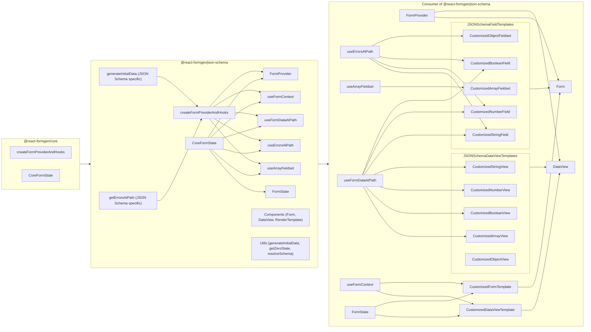

# React FormGen

## A headless, type-safe, customizable, and super simple React form and data view generator. Turn your schemas into forms and data views with ease.

### Motivation

Forms are not fun to write. They are repetitive, error-prone, and time-consuming. This library aims to make form generation as simple as possible.

The packages in this repo have been designed and developed from the ground up to be as flexible, customizable, and un-opinionated as possible.

There are two types of packages in this repo:

1. **Core package**: This package (`@react-formgen/core`) provides the core functionality for the schema-based packages. This package is not really meant to be used directly, but rather as a dependency for the schema-based packages. It serves as a "factory" for creating form providers and hooks that are schema-specific. Think of it as a "scaffolding" for the schema-based form generators.
2. **Schema-based packages**: These packages take a schema (e.g., JSON Schema, Yup schema, Zod schema, etc.) and generate forms and data views based on that schema. The schema-based packages are meant to be used directly in your projects.

### How it works

Take, for example, the JSON Schema package (`@react-formgen/json-schema`). This package takes a JSON Schema and generates a form and a data view based on that schema. The package provides a set of hooks and a provider that you can use in your components to generate forms and data views.

You can consume the JSON Schema package in your project, and customize the form and data view templates to your liking. You can also customize the field templates and data view templates to change the look and feel of the form and data view components.
